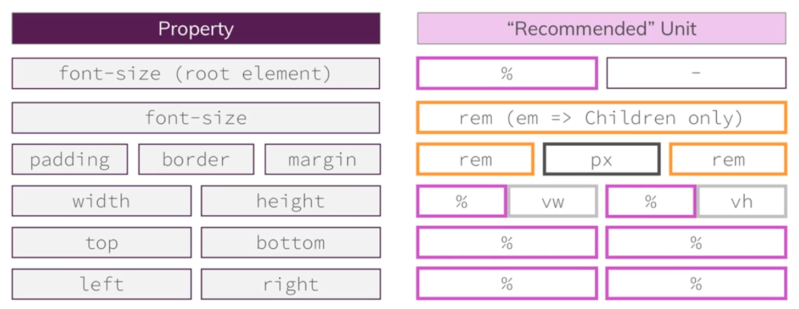
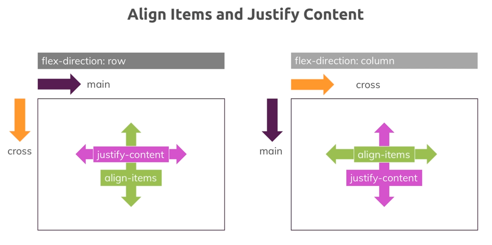

# CSS notes
Notes about CSS development

## block-level vs inline elements

**Block-level elements** are rendered as a block and hence take up all the available horizontal space. You can set `margin-top` and `margin-bottom` and two block-level elements will render in two different lines.
Some examples are: `<div>`, `<section>`, `<article>`, `<nav>` but also `<h1>`, `<h2>` etc and `<p>`.

**Inline elements** on the other hand only take up the space they require to fit their content in. Hence two inline-elements will fit into the same line (as long as the combined content doesn't take up the entire space in which case a line break would be added). In this case `margin-top` and `margin-bottom` have no effect on the element. `padding-top` and `padding-bottom` also don't push the adjacent content away but they will do so with the element border. You can read more about that behavior in the following article: https://hacks.mozilla.org/2015/03/understanding-inline-box-model/

Additionally, setting a `width` or `height` on an inline element also has no effect, they take as much space as required by the content.

Logically, this makes sense since you don't want your inline elements to destroy your multi-line text-layout. If you want to do so or need both block-level and inline behavior, you can set `display: inline-block` to merge behaviors.

Some example elements are: `<a>`, `<span>`, ``.

Full list: https://www.w3schools.com/html/html_blocks.asp

## box-sizing

By default, the width and height of an element is calculated like this:

width + padding + border = actual width of an element
height + padding + border = actual height of an element

This means: when you set the width/height of an element, the element often appears bigger than you have set (because the element's border and padding are added to the element's specified width/height).

The box-sizing property allows us to include the padding and border in an element's total width and height.

If you set `box-sizing: border-box;` on an element, padding and border are included in the width and height. Since the result of using the `box-sizing: border-box;` is so much better, many developers want all elements on their pages to work this way.

```css
* {
  box-sizing: border-box;
}
```

### Links

* https://developer.mozilla.org/en-US/docs/Web/CSS/box-sizing


## Positioning

The default positioning for the document flow is `static`. Other possible options for this property are:
* `absolute`: the element is removed from the normal document flow, and no space is created for the element in the page layout. The element is positioned relative to its closest positioned ancestor (if any) or to the initial containing block.
* `relative`: the element is positioned according to the normal flow of the document, and then offset relative to itself based on the values of top, right, bottom, and left. The offset does not affect the position of any other elements; thus, the space given for the element in the page layout is the same as if position were static.
* `fixed`: the element is removed from the normal document flow, and no space is created for the element in the page layout. The element is positioned relative to its initial containing block, which is the viewport in the case of visual media.
* `sticky`: the element is positioned according to the normal flow of the document, and then offset relative to its nearest scrolling ancestor and containing block (nearest block-level ancestor), including table-related elements

Together with this property you can manipulate the vertical and horizontal offsets with `top`, `bottom`, `left` and `right`.

`z-index` allow us to manage the layers of our HTML on the z-axis. By default all elements has this value set to 0. It can also accepts negative values. This property has impact only for elements with position different from `static`.

Docs:
* https://developer.mozilla.org/en-US/docs/Web/CSS/position
* https://developer.mozilla.org/en-US/docs/Web/CSS/CSS_positioned_layout/Understanding_z-index/Stacking_context

## Images
When you use an `img` tag, the default behavior is to use its dimensions without considering the parent that's wrapping it. Same thing if you style the image and set `height: 100%;`: this won't work since it will use the original height. However, using `height: 100%;` on the image and setting `display: inline-block` and a descresed height on the parent container, will effectively reduce the image dimensions.

## Units and dimensions
When you specify a percentage for an element, the percentage refers to the parent containing that element. This allows the website to be dynamic when for example the viewport is resized. In case the element with the percentage has a positioning the percentage refers to different elements:
* with `position: fixed`: the containing block it's the viewport.
* with `position: absolute` refers instead to the closest ancestor plus its padding that has not a static position.
* with `position: relative|static` refers instead to the closest ancestor's content which is a block level

When you specify `px` as unit for fonts, even if you choose a larger font size in the browser properties, the text using pixels will stay the same.

### Other units
Pixel is referred as an absolute length. Viewport lengths refer to the viewport, that is the user's visible area of a web page. You can give the browser instructions on how to control the page's dimensions and scaling through a meta tag:

```html
<meta name="viewport" content="width=device-width, initial-scale=1.0">
```

The `width=device-width` part sets the width of the page to follow the screen-width of the device (which will vary depending on the device). The `initial-scale=1.0` part sets the initial zoom level when the page is first loaded by the browser.
Then there are font-relative lengths (`rem`, `em`) and finally the percentages.


* `root em (rem)`: it's calculated based on the actual size of the element and multiplied by the root element (html). 1 rem ~ 16px
* `em`: it's calculated based on the actual size of the element and multiplied by the other applied values.
* `viewport height (vh)`: adjust to current viewport height.
* `viewport width (vw)`: adjust to current viewport width.



### Links

* [Hiding Vertical Scrollbars with Pure CSS in Chrome, IE (6+), Firefox, Opera, and Safari](https://web.archive.org/web/20180505112131/https://blogs.msdn.microsoft.com/kurlak/2013/11/03/hiding-vertical-scrollbars-with-pure-css-in-chrome-ie-6-firefox-opera-and-safari/)

## Responsive Design

The absolute length units are fixed in relation to each other and anchroed to some physical measurement. They are mainly useful when the output environment is known. The absolute units consist of the physical units ('in', 'cm', 'mm', etc) and the visual angle unit ('px').

```
1 inch = 2.54cm = 96px
```

### Viewport metatag

In a moden mobile phone there's a high pixel density that leads to the problem of visualizing a site way too small if we do not use the viewport metatag with the appropriate content.

```html
<meta name="viewport" content="width=device-width, initial-scale=1.0">
```

This metatag adjust the site to the device viewport. It just translates the pixels according to the pixel ratio. `initial-scale` regulates the initial zoom, the greater the number the greater the zoom.

### Media queries

Media queries change design - according to our definitions - depending on size. Usually you define conditions based of the viewport's width. Choosing breaking points (width threshold for customizing your CSS rules) may be based on [common devices width](https://yesviz.com/viewport/).


### Links

* [Viewport meta tag](https://developer.mozilla.org/en-US/docs/Web/HTML/Viewport_meta_tag)
* [Media queries](https://developer.mozilla.org/en-US/docs/Web/CSS/Media_Queries)

## Fonts and text

* Generic families: define specific core attributes of the fonts. Example are `serif`, `sans-serif`, `cursive`, `monospace`, `fantasy`.
* Font families: they're specific fonts included in a generic family. For example, have Times New Roman and Georgia are part of serif generic family.

By default if you do not specify any style, what will be displayed is defined by the browser's style. If you specify a generic family without specifying a specific font family, the browser will chose the geenric family defined in its settings. When you specify a font family this is not influenced by the browser's settings. In the last case, it's better to choose a web font, so that it can be downloaded by any browser.

For 90%+ of the cases you likely want the `<link>` tag. As a rule of thumb, you want to avoid `@import` rules because they defer the loading of the included resource until the file is fetched and if you have a build process which "flattens" the @import's, then you create another problem with web fonts: dynamic providers like Google WebFonts serve platform-specific versions of the fonts, so if you simply inline the content, then you'll end up with broken fonts on some platforms.
Now, why would you use the web font loader? If you need complete control over how the fonts are loaded. Most browsers will defer painting the content to the screen until all of the CSS is downloaded and applied - this avoids the "flash of unstyled content" problem. The downside is you may have an extra pause and delay until the content is visible. With the JS loader, you can define how and when the fonts become visible for example, you can even fade them in after the original content is painted on the screen.
Once again, the 90% case is the `<link>` tag: use a good CDN and the fonts will come down quick and even more likely, be served out of the cache.
Google Web Fonts tag now uses `rel="preconnect"`. This will speed up DNS and the TLS / TCP connection to the server without using up bandwidth right away in downloading the font.

### Links

* [Make the Web Fast: Google Web Fonts - making pretty, fast!](https://www.youtube.com/watch?v=sqesm0euf9M)

## Flexbox
Applying the `display: flex` property to an element, turns this element into a flex container. The nested elements are called flex items.
Parent properties:
* flex-flow
* justify-content
* align-content
* align-items

Children properties:
* order
* flex
* align-self



### Links

* [Basic concepts of Flexbox](https://developer.mozilla.org/en-US/docs/Web/CSS/CSS_Flexible_Box_Layout/Basic_Concepts_of_Flexbox)


## Resources

* [Academind](https://discord.com/invite/gxvEWGU)
* [W3C standards](https://www.w3.org/TR/?filter-tr-name=&status%5B%5D=standard&tags%5B%5D=css#tr_Cascading_Style_Sheets__CSS__Working_Group)
* [CSS reference](https://developer.mozilla.org/en-US/docs/Web/CSS)
* [Google Fonts](https://fonts.google.com/)
* [Can I Use](https://caniuse.com/)
